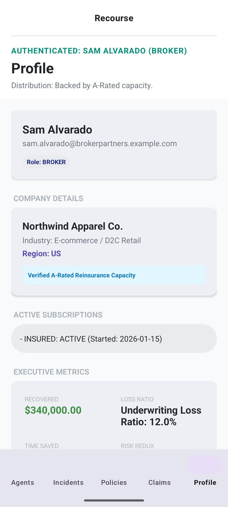
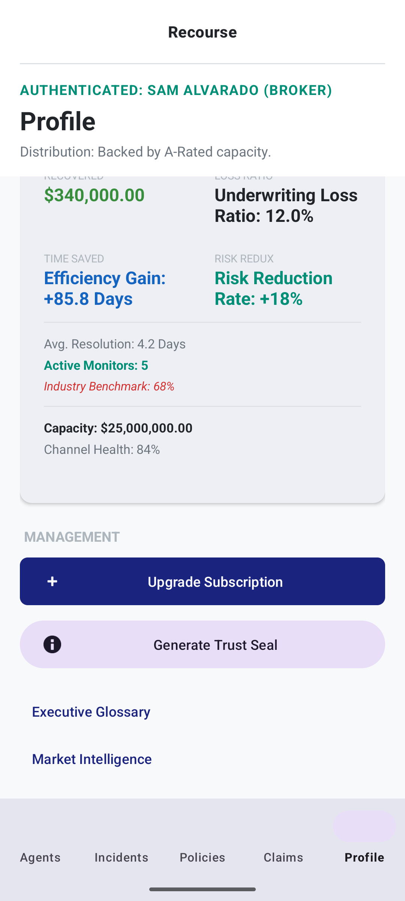
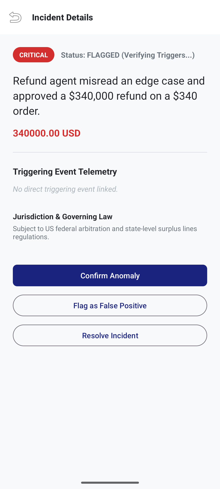
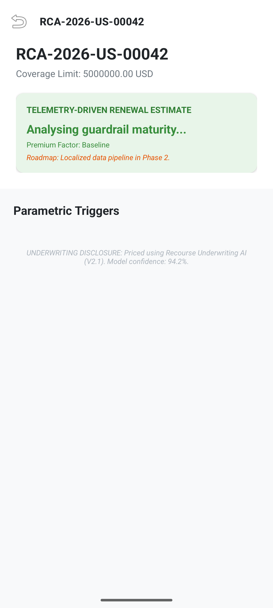
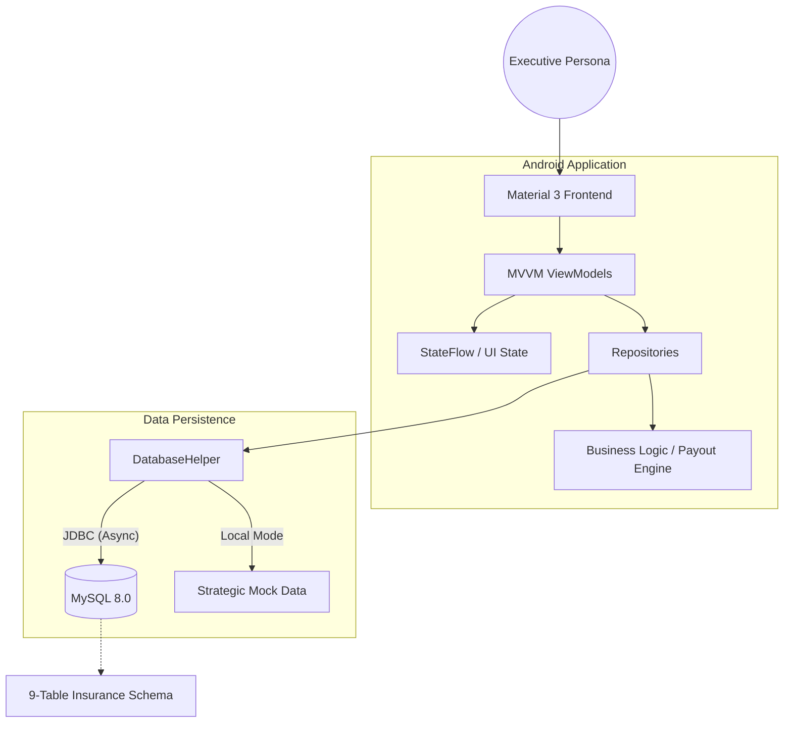
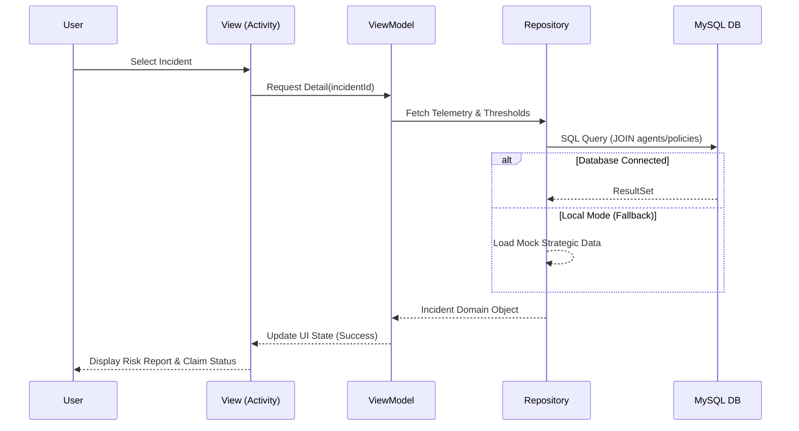

# Recourse.ai - High-Fidelity Parametric Insurance Prototype

[](https://www.gnu.org/licenses/agpl-3.0)
[](https://developer.android.com)
[](https://kotlinlang.org)

Recourse.ai is an Android prototype that bridges AI operational telemetry with parametric insurance workflows. Designed for the Lloyd’s Lab ecosystem, it demonstrates how organizations can **bound the downside of automation** by converting real-time agent behavior into instant, verifiable insurance payouts.

---

## 📖 Table of Contents
1. [Business Case](#-business-case)
2. [Target Personas & Use Cases](#-target-personas--use-cases)
3. [Application Preview](#-application-preview)
4. [Architecture](#-architecture)
5. [Technology Stack](#-technology-stack)
6. [Project Structure](#-project-structure)
7. [Getting Started](#-getting-started)
8. [Configuration](#-configuration)
9. [Security & Compliance](#-security--compliance)
10. [Roadmap & Venture Strategy](#-roadmap--venture-strategy)
11. [Contribution & License](#-contribution--license)

---

## 💼 Business Case

### The Problem
Traditional Errors & Omissions (E&O) insurance is ill-equipped for the "speed of AI." Claims take 90+ days to settle, underwriting is based on static forms rather than live telemetry, and "Silent AI" exposure creates unquantifiable risk for the board.

### The Recourse Solution
Recourse.ai provides a **Continuous Monitoring Layer** that:
- **Quantifies Risk**: Assigns a "Guardrail Maturity Score" based on live agent behavior.
- **Automates Payouts**: Uses parametric triggers to clear funds in < 48 hours when pre-agreed safety thresholds are crossed.
- **Benchmarks Performance**: Provides CFOs with real-time ROI and efficiency gain metrics relative to traditional benchmarks.

---

## 👥 Target Personas & Use Cases

| Persona | Primary Objective | Key Feature Used |
| :--- | :--- | :--- |
| **CFO / COO** | ROI & Financial Stability | Executive Metric Grid (Recovered Funds, Efficiency Gains) |
| **Head of AI** | Operational Reliability | Agent Telemetry & Automatic Safety Kill-Switches |
| **General Counsel** | Governance & Audit | Region-specific Compliance Audits (EU AI Act, DIFC) |
| **Broker** | Capacity Distribution | Capacity Monitoring & Parametric Policy Management |

---

## 📱 Application Preview

### 1. Unified Executive Entry
Secure, persona-driven authentication designed for instant boardroom demonstrations.


### 2. Operational Risk Dashboard
A real-time overview of AI agent health, guardrail maturity, and anomalous activity pulses.


### 3. Incident Deep-Dive
Automated risk assessment of flagged anomalies, including estimated financial exposure and jurisdictional legal context.


### 4. Parametric Policy Logic
Full transparency into the "Rules Engine" logic that governs automatic insurance triggers.


---

## 🏗 Architecture

### High-Level System Design
The prototype uses a decoupled MVVM architecture with a resilient data layer that supports both live JDBC connections and high-fidelity mock fallbacks for offline stability.



### Data Flow Lifecycle
The following diagram illustrates the request-response lifecycle during a parametric trigger verification:



---

## 🛠 Technology Stack

### 📱 Frontend / Mobile
- **Kotlin**: Primary programming language for modern, type-safe development.
- **Jetpack KTX**: Used for concise, idiomatic Android development (e.g., `isVisible`).
- **Material 3**: Premium UI components and Navy/Teal branding.
- **Coroutines & StateFlow**: Asynchronous stream handling for high-performance UI updates.

### 🗄 Backend & Data
- **MySQL 8.0**: Relational database for policy, claim, and telemetry storage.
- **JDBC**: Direct database integration for low-latency prototype response.
- **Resiliency Layer**: Custom "Local Mode" logic that ensures 100% uptime during pitches.

### 🛡 Security & Governance
- **Compliance Engines**: Hardcoded logic for EU AI Act (Art. 14), DIFC Reg 10, and MAS Sandbox Plus.
- **Parametric Verification**: Deterministic rules-engine logic to prevent "Black Box" claim disputes.

---

## 📁 Project Structure

```text
Recourse/
├── app/                        # Main Android module
│   ├── src/main/java/          # Kotlin source code
│   │   ├── data/               # Data Layer (Models, Repositories, DB)
│   │   └── ui/                 # UI Layer (Activities, Adapters, ViewModels)
│   └── src/main/res/           # Android resources (Layouts, Themes, Values)
├── docs/                       # Project Documentation
│   ├── screenshots/            # Visual assets for README
├── README.md                   # Enterprise documentation
└── build.gradle.kts            # Project-level build configuration
```

---

## 🚀 Getting Started

### Prerequisites
- **Android Studio Ladybug** or newer.
- **JDK 11** (Standardized target).
- **MySQL Server 8.0** (Optional, app will run in "Local Mode" without it).
- **Pixel 8 Emulator/Device** (Recommended for layout integrity).

### Installation
1.  Clone the repository:
    ```bash
    git clone https://github.com/alfinohatta/recourse.git
    ```
2.  Open the project in Android Studio.
3.  Copy `.env.example` to `.env` (Symbolic for prototype config).
4.  Sync Gradle and build the project.

### Running the Demo
For the "One-Tap Strategic Demo":
1.  Deploy the app to an emulator.
2.  On the Login screen, enter: `dana.whitfield@northwindapparel.example.com`.
3.  Tap **SIGN IN**. The app will bypass DB latency and load the full CFO dashboard immediately.

---

## 🛡 Security & Compliance
- **Data Minimization**: The telemetry layer only captures agent *metadata* and financial *amounts*, avoiding PII where possible.
- **Local Resilience**: In a production environment, JDBC would be replaced by an authenticated REST API. This prototype uses direct JDBC for performance during high-stakes demonstrations.
- **Compliance Audit**: View the "Risk Report" in any AI Agent detail view to see the automated audit trail for regional regulations.

---

## 📈 Roadmap & Venture Strategy
Recourse.ai is positioned as a first-mover in the Agentic AI Insurance space. Our multi-year sequencing includes:
1.  **Phase 1**: Beachhead in D2C Retail ( MAS/ADGM Sandboxes).
2.  **Phase 2**: secure A-Rated Capacity & Formalize Broker Channel.
3.  **Phase 4**: Pivot to embedded platform distribution (White-label).

---

## 📄 Contribution & License
This project is licensed under the **GNU Affero General Public License v3.0 (AGPL-3.0)**. 

### Why AGPL?
We believe in the transparency of insurance logic. If you use the Recourse Parametric Rules Engine in a hosted service, you must share your modifications with the community to ensure "Black Box" insurance remains a thing of the past.

---
*Trusted by Lloyd's Lab Alumni | Bounding the Downside of Automation*
